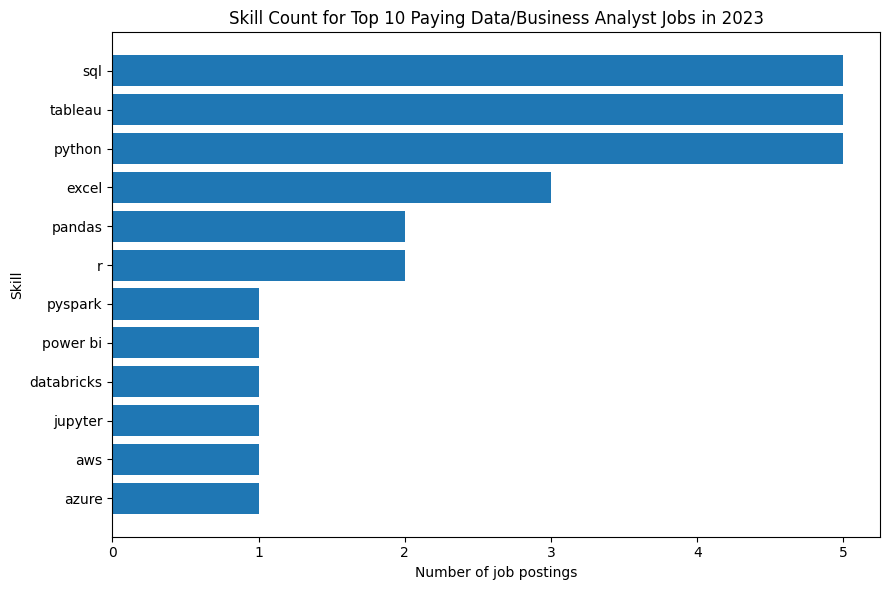
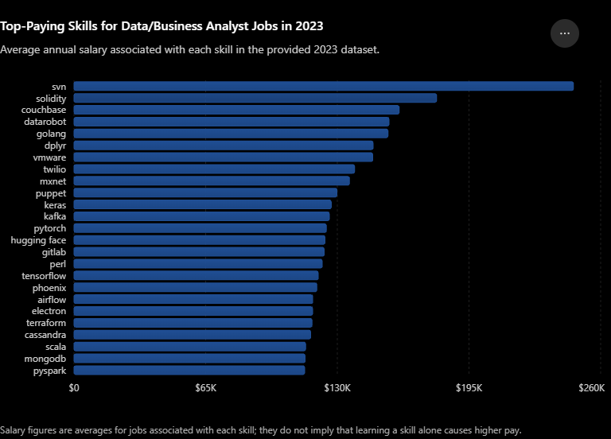

# Introduction

📊 Dive into the data job market! Focusing on data analyst and business analyst roles, this project explores 💰 top-paying jobs, 🔥 in-demand skills, and 📈 where high demand meets high salary in the data analytics field.

🔍 SQL queries? Check them out here: [project_sql folder](/project_sql/)

# Background

Driven by a quest to navigate the data analyst and business analyst job market more effectively, this project was born from a desire to pinpoint top-paid and in-demand skills, streamlining others' work to find optimal jobs.

Data hails from my [SQL Course](https://www.lukebarousse.com/sql). It's packed with insights on job titles, salaries, location, and essential skills.


### The questions I wanted to answer through my SQL queries were :

1. What are the top paying data analyst jobs and business analyst?
2. What skills are required for this top paying jobs?
3. What skills are most in demand for data analyst and business analyst?
4. Which skills are associated with higher salaries?
5. What are the most optimal skills to learn?

# Tools I Used

For my deep dive into the data analyst job market, I harnessed the power of several key tools:

- **SQL :** The backbone of my analysis, allowing me to query the database and unearth critical insights.
- **PostgreSQL :** The chosen database management system, ideal for handling the job posting data.
- **Visual Studio Code :** My go-to for database management and executing SQL queries.
- **Git & Github :** Essential for version control and sharing my SQL scripts and analysis, ensuring collaboration and project tracking.
# The Analysis

Each query for this project aimed at investigating specific aspects of the data analyst and business analyst job market. Here's how I approached each question:

### 1. Top paying data analyst jobs and business analyst

To identify the highest-paying roles, I filtered data analyst and business analyst positions by average yearly salary and location, focusing on remote jobs. This query highlights the high paying opportunities in the field.

```sql
SELECT 
    job_id,
    job_title,
    name AS company_name,
    job_location,
    job_schedule_type,
    salary_year_avg,
    job_posted_date
FROM
    job_postings_fact
LEFT JOIN
    company_dim ON job_postings_fact.company_id = company_dim.company_id
WHERE
    (job_title_short = 'Data Analyst' OR job_title_short = 'Business Analyst')
    AND job_location = 'Anywhere'
    AND salary_year_avg IS NOT NULL
ORDER BY
    salary_year_avg DESC
LIMIT
    10;
```

Here's the breakdown of the top 10 highest-paying data analyst and business analyst jobs in 2023:

- **Wide salary range:** The top 10 paying roles span from $200,000 to a striking $650,000, signaling significant salary potential within the field.
- **Diverse employers:** Companies like Mantys, Meta, AT&T, and Pinterest are among those offering high salaries, showing a broad interest across different industries — from tech giants to specialized firms.
- **Job title variety:** There's a high diversity in job titles, from Data Analyst to Director of Analytics, reflecting varied roles and specializations within data analytics.


| Rank | Position                            | Company           |   Annual Salary |
| ---: | ----------------------------------- | ----------------- | --------------: |
|    1 | Data Analyst                        | Mantys            |    **$650,000** |
|    2 | Director of Analytics               | Meta              |    **$336,500** |
|    3 | Associate Director – Data Insights  | AT&T              | **$255,829.50** |
|    4 | Data Analyst, Marketing             | Pinterest         |    **$232,423** |
|    5 | Lead Business Intelligence Engineer | Noom              |    **$220,000** |
|    6 | Data Analyst (Hybrid/Remote)        | UCLA Health       |    **$217,000** |
|    7 | Manager II, Applied Science         | Uber              |    **$214,500** |
|    8 | Principal Data Analyst              | SmartAsset        |    **$205,000** |
|    9 | Analyst                             | Multicoin Capital |    **$200,000** |
|   10 | Analyst                             | Multicoin Capital |    **$200,000** |


*Table of the top 10 highest paying data analyst and business analyst jobs in 2023, compiled from the query results above*

### 2. Skills required for this top paying jobs

To understand what skills are required for the top-paying jobs, I joined the job postings with the skills data, providing insights into what employers value for high-compensation roles.

```sql
WITH top_paying_jobs AS (
    SELECT 
        job_id,
        job_title,
        name AS company_name,
        salary_year_avg
    FROM
        job_postings_fact
    LEFT JOIN
        company_dim ON job_postings_fact.company_id = company_dim.company_id
    WHERE
        (job_title_short = 'Data Analyst' OR job_title_short = 'Business Analyst')
        AND job_location = 'Anywhere'
        AND salary_year_avg IS NOT NULL
    ORDER BY
        salary_year_avg DESC
    LIMIT 10
)

SELECT 
    top_paying_jobs.*,
    skills
FROM 
    top_paying_jobs
JOIN 
    skills_job_dim ON top_paying_jobs.job_id = skills_job_dim.job_id
JOIN 
    skills_dim ON skills_job_dim.skill_id = skills_dim.skill_id  
ORDER BY
    salary_year_avg DESC;

```

Here's the breakdown of the most demanded skills for the top 10 highest-paying data analyst and business analyst jobs in 2023:

- **SQL, Python, and Tableau are the clear frontrunners**, each appearing in 5 out of the 8 top-paying job postings that listed skills — reinforcing that this trio forms the essential backbone for high-compensation analytics roles.
- **Excel still holds relevance at the top tier**, showing up in 3 postings, proving that foundational tools remain valuable even in senior, high-paying positions.
- **Other skills like Azure, AWS, Databricks, and PySpark** appear in specialized roles (like AT&T's Associate Director position), suggesting that cloud and big-data expertise becomes a differentiator as seniority and salary increase.



*Bar chart visualizing the count of skills for the top 10 highest paying jobs for data analysts and business analysts*

### 3. Most in demand skills for data analyst and business analyst

To identify the skills most frequently requested in job postings, I joined job postings with skills data and counted the occurrences of each skill, directing focus to the most sought-after expertise.

```sql
SELECT 
    skills,
    COUNT(job_postings_fact.job_id) AS demand_count
FROM 
    job_postings_fact
JOIN 
    skills_job_dim ON job_postings_fact.job_id = skills_job_dim.job_id
JOIN 
    skills_dim ON skills_job_dim.skill_id = skills_dim.skill_id
WHERE
    job_title_short = 'Data Analyst' OR
    job_title_short = 'Business Analyst'
GROUP BY 
    skills
ORDER BY
    demand_count DESC
LIMIT 5;
```

Here's the breakdown of the most in-demand skills for data analysts and business analysts in 2023:

| Rank | Skill | Demand Count |
|---:|---|---:|
| 1 | SQL | 110,000 |
| 2 | Excel | 84,165 |
| 3 | Python | 65,423 |
| 4 | Tableau | 55,878 |
| 5 | Power BI | 48,719 |

*Table of the top 5 most in-demand skills for data analyst and business analyst job postings*

- **SQL and Excel dominate the field**, confirming that strong querying and spreadsheet skills remain the non-negotiable foundation for both data analyst and business analyst roles.
- **Python holds a solid third place**, showing that programming skills continue to grow in importance beyond just SQL, especially for more advanced analysis and automation tasks.
- **Visualization tools (Tableau and Power BI)** round out the top 5, highlighting that the ability to communicate insights visually is just as valued as the ability to extract and manipulate raw data.

### 4. Skills that are associated with higher salaries

To identify which skills command the highest salaries, I analyzed the average yearly salary associated with each skill across data analyst and business analyst postings, spotlighting where technical depth translates into financial reward.

```sql
SELECT 
    skills,
    ROUND(AVG(salary_year_avg), 0) AS avg_salary
FROM 
    job_postings_fact
JOIN 
    skills_job_dim ON job_postings_fact.job_id = skills_job_dim.job_id
JOIN 
    skills_dim ON skills_job_dim.skill_id = skills_dim.skill_id
WHERE
    (job_title_short = 'Data Analyst' OR job_title_short = 'Business Analyst')
    AND salary_year_avg IS NOT NULL
GROUP BY 
    skills
ORDER BY
    avg_salary DESC
LIMIT 25;
```

Here's a breakdown of the results for the top-paying skills for data analysts and business analysts in 2023:
- **Niche and specialized tools command a premium**, with skills like SVN, Solidity, and Couchbase topping the list — this suggests that rare or highly specific technical expertise, even outside the "typical" analyst toolkit, can significantly boost earning potential.
- **Machine learning and AI frameworks feature heavily** (Keras, Kafka, PyTorch, Hugging Face, TensorFlow), indicating that analysts who branch into ML/AI-adjacent skill sets are rewarded with notably higher salaries compared to traditional analytics tools.
- **Big data and cloud engineering skills** (Cassandra, MongoDB, PySpark, Terraform, Airflow) also rank consistently high, reinforcing that comfort with large-scale data infrastructure is a strong salary differentiator as roles scale in seniority and technical demand.



*Bar chart visualizing the average salary for the top 25 paying skills for data analysts and business analysts*

### 5. The most optimal skills to learn

To pinpoint the skills that offer both job security (high demand) and financial benefit (high salary), I calculated the demand and average salary for each skill, filtering for skills mentioned in more than 10 job postings to focus on the most viable options — those that are common enough to be worth pursuing, while still commanding strong pay.

```sql
WITH skill_stats AS (
    SELECT 
        skills_dim.skill_id,
        skills_dim.skills,
        COUNT(job_postings_fact.job_id) AS demand_count,
        ROUND(AVG(salary_year_avg), 0) AS avg_salary
    FROM job_postings_fact
    JOIN skills_job_dim ON job_postings_fact.job_id = skills_job_dim.job_id
    JOIN skills_dim ON skills_job_dim.skill_id = skills_dim.skill_id
    WHERE
        (job_title_short = 'Data Analyst' OR job_title_short = 'Business Analyst')
        AND salary_year_avg IS NOT NULL
    GROUP BY skills_dim.skill_id
)
SELECT *
FROM skill_stats
WHERE demand_count > 10
ORDER BY avg_salary DESC
LIMIT 20;
```

Here's a breakdown of the most optimal skills for data analysts and business analysts in 2023:
- **Big data and cloud tools dominate the optimal list**, with Snowflake (275 postings), Spark (201), and Hadoop (154) offering the strongest balance of high demand and strong compensation — these represent the safest, highest-leverage skills to prioritize.
- **Specialized ML/AI skills pay the most but come with lower demand**, such as Kafka, PyTorch, and TensorFlow — valuable to learn once foundational skills are solid, but riskier as a first investment due to fewer available roles.
- **Workflow and orchestration tools** (Airflow, Databricks, GCP) show a healthy mix of demand and salary, suggesting that cloud-based data engineering adjacent skills are increasingly expected even in analyst-titled roles, not just engineering positions.

| Skill ID | Skill | Demand Count | Avg. Salary ($) |
|---:|---|---:|---:|
| 98 | Kafka | 46 | 126,035 |
| 101 | PyTorch | 23 | 124,588 |
| 31 | Perl | 21 | 122,520 |
| 99 | TensorFlow | 27 | 120,612 |
| 137 | Phoenix | 39 | 119,921 |
| 96 | Airflow | 77 | 117,870 |
| 63 | Cassandra | 13 | 116,881 |
| 3 | Scala | 64 | 114,367 |
| 18 | MongoDB | 29 | 114,131 |
| 62 | MongoDB | 29 | 114,131 |
| 95 | PySpark | 50 | 113,883 |
| 219 | Atlassian | 17 | 113,617 |
| 97 | Hadoop | 154 | 113,462 |
| 75 | Databricks | 106 | 112,331 |
| 92 | Spark | 201 | 112,236 |
| 169 | Linux | 63 | 112,112 |
| 193 | Splunk | 16 | 112,067 |
| 80 | Snowflake | 275 | 111,697 |
| 81 | GCP | 89 | 111,478 |
| 234 | Confluence | 69 | 110,891 |

*Table of the most optimal skills for data analysts and business analysts, sorted by salary*

**Note on data nuance:** MongoDB appears twice in the results (skill_id 18 and 62) with identical demand and salary figures — this reflects how the source dataset categorizes it under two different skill types ("programming" and "database"), highlighting MongoDB's dual role as both a database technology and a common part of modern application development stacks.


# What I Learned

Throughout this journey, I've turbocharged my SQL toolkit with some serious firepower:

- 🧩 **Complex Query Crafting:** Mastered the art of advanced SQL, merging tables like a pro and wielding WITH clauses for ninja-level temp table maneuvers.
- 📊 **Data Aggregation:** Got cozy with GROUP BY and turned aggregate functions like COUNT() and AVG() into my data-summarizing sidekicks.
- 💡 **Analytical Wizardry:** Leveled up my real-world puzzle-solving skills, turning questions into actionable, insightful SQL queries.
- 🧹 **Data Nuance Awareness:** Learned to spot and question inconsistencies in source data (like the MongoDB dual-category case) rather than blindly trusting query output.

# Conclusion

This project has been a deep dive into the data analyst and business analyst job market, uncovering the skills and salary trends that shape opportunities in this field. The findings from the queries above provide a clearer, data-backed picture of what's really in demand — and what's genuinely worth prioritizing when it comes to skill development.

### Insight

From the analysis, several general insights emerged:

1. 💰 **Top-Paying Data Analyst & Business Analyst Jobs:** The highest-paying roles for these positions range widely, with the top job posting reaching a staggering $650,000, proving there's serious earning potential at the senior end of the field.
2. 🛠️ **Skills for Top-Paying Jobs:** SQL, Python, and Tableau consistently appear among the top-paying jobs, confirming these as essential skills for those aiming for high-compensation roles.
3. 📈 **Most In-Demand Skills:** SQL and Excel remain the most requested skills across job postings, making them the non-negotiable foundation for anyone entering the field.
4. 🌟 **Skills with Higher Salaries:** Specialized and niche skills, such as SVN and Solidity, are associated with the highest average salaries, indicating a premium on rare, specialized expertise.
5. 🚀 **Optimal Skills for Job Market Value:** Skills like Snowflake, Spark, and Hadoop strike the best balance between high demand and high salary, making them the smartest long-term investments for skill development.

### Closing Thoughts

This project sharpened my SQL skills while delivering genuinely useful insights into the data analyst and business analyst job market. The findings from this analysis serve as a compass for prioritizing skill development and shaping job search strategy — showing that going for both high-demand AND high-paying skills, rather than chasing one at the expense of the other, is the smarter path forward. 🎯

This exploration underscores the importance of continuous learning and staying adaptable to emerging trends in the field of data analytics. For aspiring data analysts, this analysis serves as a solid guide to prioritizing skill acquisition and navigating the job market more effectively. 🌱
